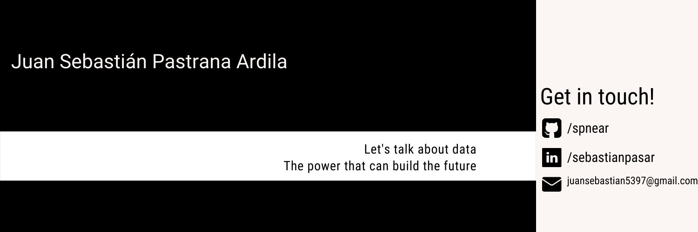

## Hi there 👋

Welcome to my repository!

I'm a Electronic Engineering student & Data Science Analyst, currently finishing my degree final project and I'm usually working with 🐍.

- I have some repositories with basic operations with data, python, some dummy datasets that I used to learn, and others specials like CV or Flask

-I'm passionated with data processing and analysis, internet of things (IoT), computer vision and cloud computing. 
-I started programming in my spare time and ended up discovering a world of solutions combining data with math and logic. 🤓

### Programming Skills 📑
#### Used in datascience
- Python
- SQL
- R

#### Backend:
- TypeScript (express)
- Python (FastAPI)

#### RDBMS:
- Oracle
- SQL Server
- Postgresql

#### NoSQL Databases:
- MongoDB
- Firebase

#### Others
- Arduino
- Micropython (WIP)
- Tableau/PowerBI

### Not true skills, but I have some knowledge:
- C++
- Java (Android Studio)

### More about me:
Social Networks: [linktr](http://linktr.ee/sebastianpasar)
Blogs:

Collaboration:
  - [git init](https://lauralpezb.medium.com/git-init-7cc0c1d4547d)
  - [git remote](https://lauralpezb.medium.com/git-remote-9b90c18cb78e)

<!---
spnear/spnear is a ✨ special ✨ repository because its `README.md` (this file) appears on your GitHub profile.
You can click the Preview link to take a look at your changes.
--->
